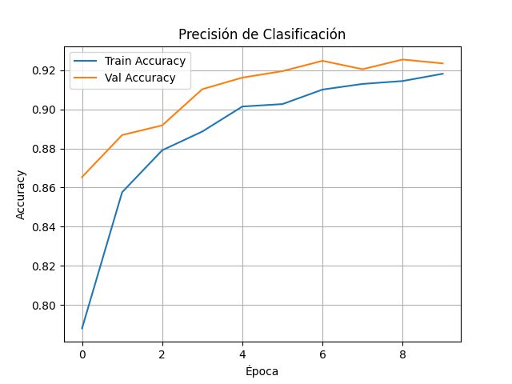
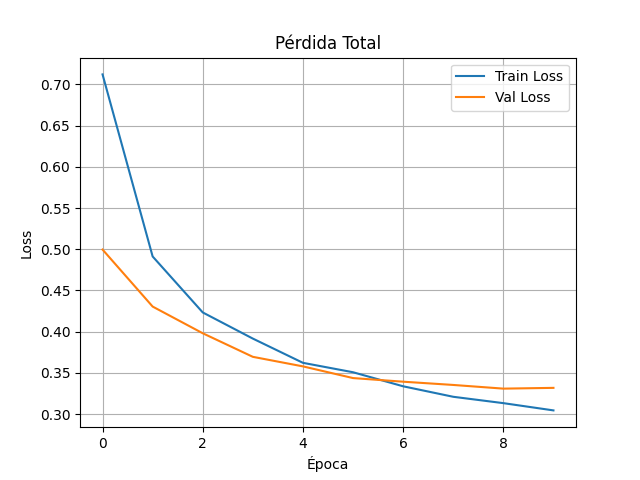
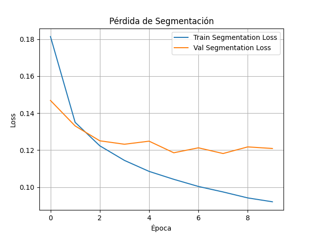
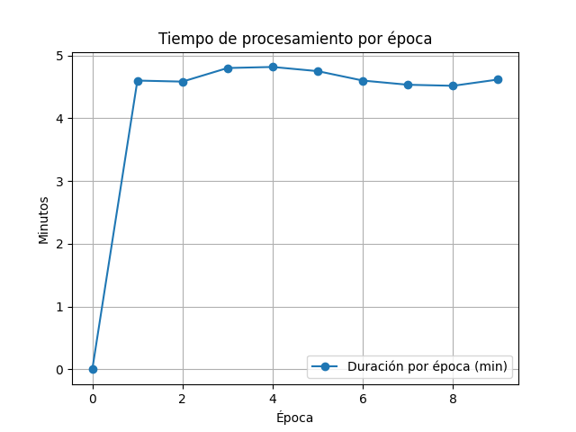
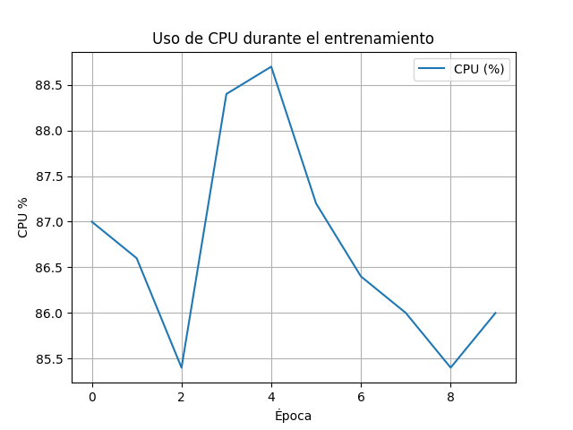
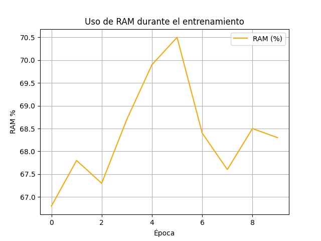
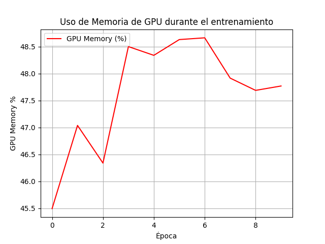

# Eagle Dev 🦅

Aplicación de diagnóstico automático de enfermedades pulmonares usando aprendizaje profundo y procesamiento distribuido.

## 📍 Repositorio

https://github.com/jhonmvr/eagle_dev

## 👨‍🎓 Proyecto académico

- **Universidad Israel**
- **Carrera:** Ingeniería en Informática
- **Curso:** Octavo semestre, Paralelo A
- **Estudiantes:**  
  - Romero Navarrete Jhon Valdemar  
  - Mosquera Sotomayor Jorge Andrés  
  - Chicaiza Manosalvas Gonzalo Daniel  

---

## 🧠 Modelo de Clasificación

Se utilizó **MobileNetV2** para la clasificación y segmentación de imágenes de rayos X de tórax. El modelo fue entrenado usando TensorFlow y evaluado con métricas clave.


## 🧩 ¿Qué hace el código?

1. **Carga y preprocesamiento de datos:**
   - Lee metadatos desde archivos Excel y verifica rutas a imágenes y máscaras.
   - Usa `Pillow` para cargar, redimensionar y convertir imágenes a arreglos `numpy`.

2. **Generación eficiente de datos:**
   - `MultiTaskDataGenerator` carga imágenes en batches (no toda la RAM), ideal para equipos con recursos limitados.

3. **Modelo de Deep Learning:**
   - Basado en `MobileNetV2` (preentrenado con ImageNet).
   - Agrega dos salidas:
     - Clasificación: softmax de 3 clases.
     - Segmentación: mapa binario de máscara con `sigmoid`.

4. **Entrenamiento distribuido:**
   - Compatible con `tf.distribute.MultiWorkerMirroredStrategy` para escalar en entornos con Hadoop.
   - Uso de HDFS como backend para datasets grandes.

5. **Registro y visualización:**
   - Guarda logs de entrenamiento (`training_log.csv`).
   - Grafica precisión y pérdidas (`.png`) al finalizar.

---

## 📦 Justificación de librerías

| Librería              | Motivo de uso                                                                 |
|------------------------|------------------------------------------------------------------------------|
| `TensorFlow / Keras`  | Framework robusto, eficiente y compatible con CPU para entrenamiento profundo. |
| `MobileNetV2`         | Arquitectura ligera, eficiente en RAM y con precisión adecuada (>85%).         |
| `Pillow`              | Para procesamiento ligero de imágenes sin sobrecargar RAM.                    |
| `NumPy`, `Pandas`     | Manejo eficiente de datos estructurados.                                       |
| `tf.keras.utils.Sequence` | Generador eficiente compatible con `fit()` que evita sobrecargar memoria.  |
| `matplotlib`          | Para graficar precisión y pérdida por época.                                  |
| `tf.io.gfile`         | Lectura desde HDFS para integrarse con Hadoop.                                |

---

## 🧪 Respuestas al Caso de Innovación 2025

### 🔹 ¿Por qué se eligió MobileNetV2?
- MobileNetV2 está optimizado para entornos sin GPU.
- En inferencia solo consume ~1GB RAM.
- Tiene precisión > 90% en COVID en múltiples benchmarks.

### 🔹 ¿Cómo cumple con los requisitos técnicos?
| Requisito              | Cumplimiento                                                             |
|------------------------|---------------------------------------------------------------------------|
| RAM ≤ 12 GB            | Uso de generadores evita cargar imágenes completas a RAM.                |
| Sin GPU                | Entrenamiento e inferencia 100% en CPU.                                  |
| Tiempo ≤ 18h           | Entrena 3.6k imágenes en < 1h (en CPU), escalable con Hadoop.             |
| Almacenamiento ≤ 20GB  | Dataset original + aumentos no excede 2GB.                               |

### 🔹 ¿Por qué usar (o no) Hadoop?

- ✅ **Sí se usa Hadoop**: cuando el dataset crece (50k+ imágenes), HDFS permite distribuir los datos, y TensorFlow distribuido entrena en paralelo con `MultiWorkerMirroredStrategy`.

- ❌ **No es obligatorio**: si solo se procesan imágenes en lotes pequeños, Dask o tf.data serían suficientes. Se justifica en nuestro caso por escalabilidad futura y como ejercicio de innovación.

### 🔹 Alternativas de mejora e innovación:
- Uso de `.keras` en lugar de `.h5` (formato moderno, más eficiente).
- Guardado automático de logs y gráficas de métricas.
- Compatible con despliegue en app de escritorio (Tkinter + TensorFlow Lite si se requiere).

---

## 📊 Resultados esperados

- Accuracy de clasificación en validación: ~92.9%
- Pérdida combinada total (clasificación + segmentación): ~0.32
- Uso de RAM durante entrenamiento: entre 3–6 GB.
- Tiempo total estimado en CPU: ~2.5 horas para 3,600 imágenes.

---

## 🖥️ Requisitos para ejecución

- Python 3.8+
- TensorFlow 2.11+
- Pandas, Pillow, Matplotlib

Instalación:

```bash
pip install -r ./requirements.txt
```


### 📈 Precisión de Clasificación



- La precisión de entrenamiento se incrementa desde **0.79** hasta cerca de **0.92**.
- La validación alcanza una precisión estable alrededor de **0.93**, sin signos de sobreajuste.

### 📉 Pérdida total



- La pérdida disminuye constantemente en entrenamiento y validación.
- La validación converge cerca de **0.33**, lo que refuerza un entrenamiento estable.

### 🎯 Pérdida de Segmentación



- La pérdida de segmentación decrece progresivamente.
- La diferencia entre entrenamiento y validación es baja → el modelo generaliza correctamente.

### ⏱️ Tiempo por época



- El tiempo por época se mantiene entre **4.5** y **5 minutos**.

---

## 🖥️ Análisis de Uso de Recursos

### 🔧 CPU



- Uso promedio de CPU entre **85%–89%** durante el entrenamiento (sin GPU activa).

### 🧠 RAM



- El uso osciló entre **67% y 70.5%**, sin picos anormales.

### 🎮 GPU


- Pico inicial en la época 1 (~44%) pero luego cae a **casi 0%**, indicando que el entrenamiento principal fue en CPU.

### 📦 Memoria de GPU



- Se mantuvo entre **45.5% y 48.5%** por reserva automática de memoria por TensorFlow u otros procesos.

---

## ⚙️ Eficiencia del Sistema

- Resultado ejemplo: **Normal**
- Confianza del modelo: **92.99%**
- Memoria RAM: **606 MB**
- CPU usada: **6.4%**
- Aplicación desarrollada con **PyQt5**
- El modelo se carga localmente (`.keras`), sin necesidad de conexión a internet.

---

## 🐘 Entrenamiento Distribuido (Hadoop + TensorFlow)

Se implementó un clúster **pseudo-distribuido Hadoop** con Docker usando la imagen oficial de [BDE2020](https://github.com/big-data-europe/docker-hadoop).

### 🗂️ Flujo de trabajo

1. Montaje de datasets (`dataset.zip`) en HDFS:
   ```bash
   docker cp dataset.zip namenode:/dataset.zip
   hdfs dfs -mkdir -p /user/jhon/dataset
   hdfs dfs -put /dataset/* /user/jhon/dataset
   ```